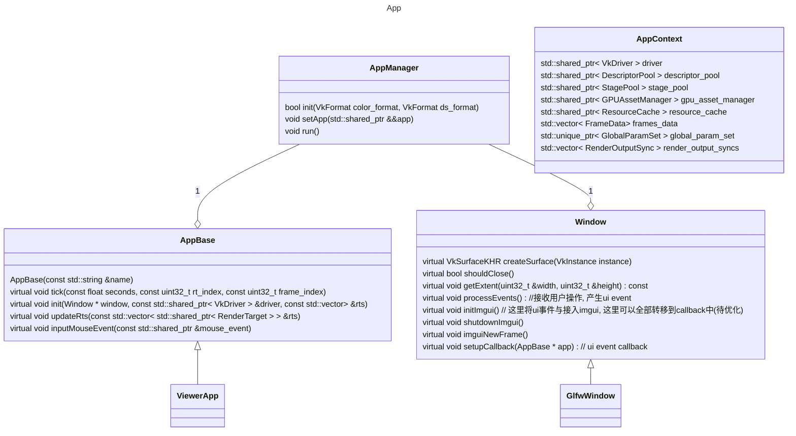

### App
| 类 |  描述 |
| --- | --- |
| Window (framework/platform/window.h) | 窗口的抽象基类. 由其负责窗口的创建、关闭、移动、缩放, imgUI的初始化接入, 接收用户的UI操作产生输入事件, 创建surface. |
| AppBase (framework/utils/app_base.h) | 应用程序的抽象基类. 实现了应用的真正逻辑, 包括初始化、每一帧的tick, 以及事件的处理. |
| AppManager (framework/utils/window_app.h) | 将Window和AppBase组装成一个完整的功能类 |
| AppContext (framework/utils/app_context.h) | 全局单例, 保存了整个系统的一些全局对象: driver, descriptor_pool(GLOBAL_SET_INDEX), stage_pool ...|

