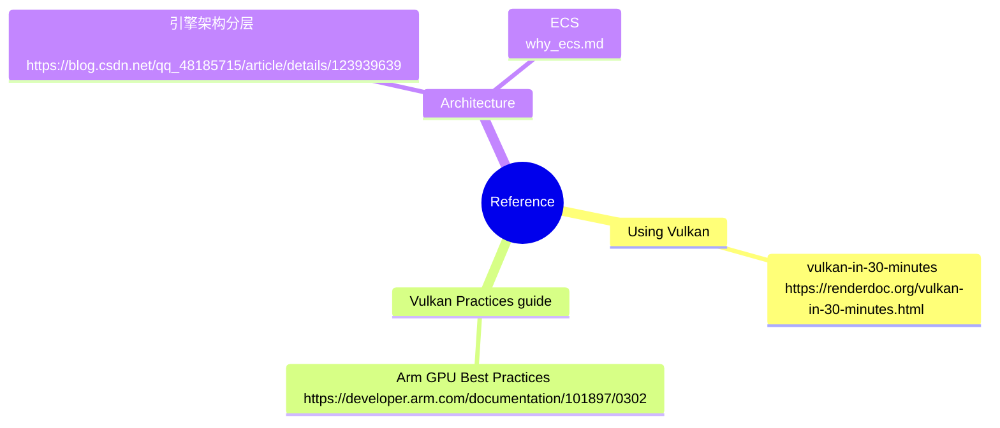

# Overview

## Design

* platform
    * file system
        provides ability to read, write, create, remove, copy file
    * window
        provides ability to create, scale window, and converts window event into a unified format.
* utils
    * vk
        vulkan wrapper, provides class encapsulation of vulkan resources, status, and commands. It also provides some auxiliary functions (such as device feature/extension config, shader compilation and parsing, resource caching, data upload and download, and thread-local command buffer management).
    * log
        log system based on spdlog.
    * event
        event system based on eventpp.
    * base
        macros and some helper functions.

实现细节:
* [Rendering System]()

## setup
run `prepare.sh` to download and build thirdparty libs.

## Reference
