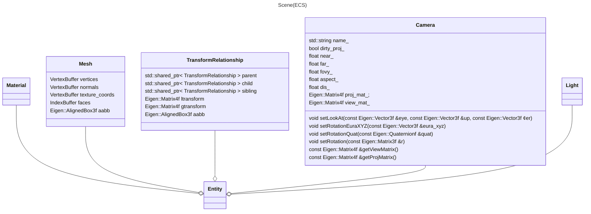
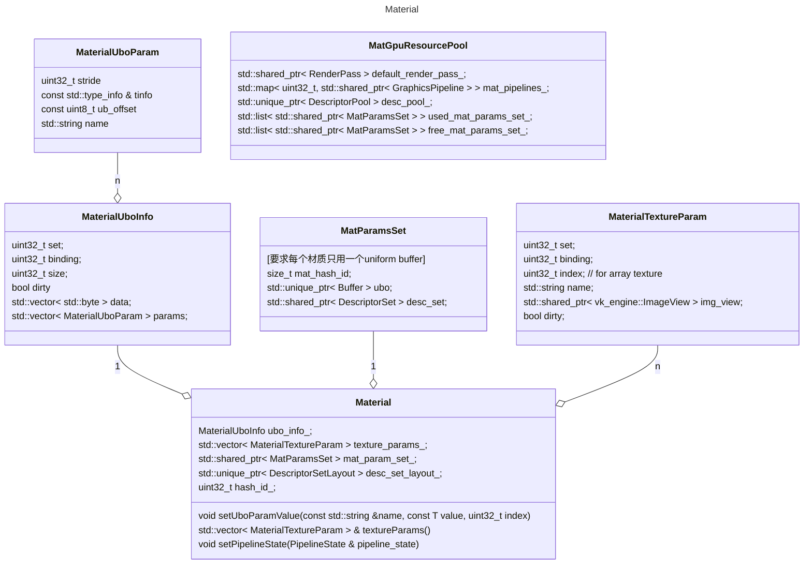
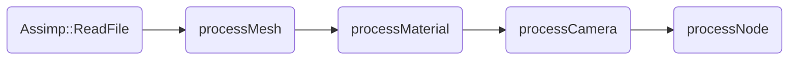

### scene
这里利用entt, 以ECS的架构来组建场景. 这里使用TransformRelationship, 来表示entity的父子关系(这里处于性能的考虑, 每个节点设置三个指针parent, child, sibling).

[为什么使用ECS](why_ecs.md)

#### Material
Material类定义了某种材质(类似于Blender中的Material node), 负责对外提供该材质的渲染能力(pipeline state设置+DescriptorSetLayout获取, 参数设置、纹理设置等).

在引擎中材质种类有限, 但使用同一种材质的物体会很多. 因此对材质相关GPU资源构建缓存进行复用: `MatGpuResourcePool`.

#### Light

基于物理的度量, 灯光的亮度度量 $\to$ 反射亮度度量 $\to$ 相机曝光设置 $\to$ 图片曝光值.

参考[filament](https://google.github.io/filament/Filament.md.html#lighting/directlighting)

在进行计算时, 有两种度量方式: ①辐射度; ②光度. 辐射度很全面(包含不可见光), 一般引擎使用光度(因为我们只关注可见光).

| Photometric term | Notation | Unit |
| --- | --- | --- |
| luminance power | $\Phi$ 光照的功率, 可以用来描述人造光源(Point/Spot) Light | lm |
| luminance intensity | $I$ 单位立体角上的光照功率, 可以用来描述人造光源(Point/Spot) Light | lm/sr, candlar |
| iluminance | $E$ 单位面积上接受到的光照功率, 可以用来描述方向光(太阳光) | lm/m^2 |
| luminance | $L$ 人眼感受到的从某个物体, 特定角度发射过来的光的亮度 | lm/(sr * m^2), Nit |

注: 在很多引擎内, 人造光源用使用W(瓦)来表示光照功率, 需要转换到lm(以理想的最大转换率进行转换). $lm = 683 \cdot W$

* Point Light
    对于Point Light 在以其为中心的单位球面上接受到的光照强度处处相等. 根据球面积分:
    $$
    \begin{aligned}
    \Phi &= \int_0^\pi \int_0^{2\pi} d^2 \sin \theta I d\phi d\theta\\
    \Rightarrow I &= \frac{\Phi}{4\pi d^2}
    \end{aligned}
    $$

* Spot Light
    Spot Light 可以看做是被遮蔽了大部分角度的Point Light. 类似的有:
    
    $$
    \begin{aligned}
    \Phi &= \int_0^{\theta_o} \int_0^{2\pi} d^2 \sin \theta I d\phi d\theta\\
    \Rightarrow I &= \frac{\Phi}{2\pi d^2 (1 - \cos \theta_o)}
    \end{aligned}
    $$

    这里, $\theta_o$是Spot Light的半角. 按照这样建模, 在调整$\theta_o$时会改变I. 一般改为:
    
    $$
    I  = \frac{\Phi}{\pi d^2}
    $$

    同时, 为了模拟Spot Light在中间强, 边缘弱的特点, 增加一个参数$b \in [0, 1]$. $\theta_i = \theta_o b$, 在$\theta_i$的角度内满强度, 在$\theta_i \to \theta_o$角度内强度逐渐减弱到0.

    $$
    \begin{aligned}
    I &= \frac{\Phi}{\pi d^2} \lambda(l)\\
    \lambda(l) &= \frac{l \cdot light\_dir - \cos \theta_o}{\cos \theta_i - \cos \theta_o}
    \end{aligned}
    $$

    在真正计算衰减的时候, 需要防止除0, 并裁剪过远的光(r是光照的影响范围, 后面那项是为了在r范围内平滑过度).

    $$    
    E = \frac{I}{\max(d^2, {0.01}^2)} \left< 1 - \frac{d^4}{r^4} \right>^2
    $$

* Photometric Light
    TODO

* Area Light
    TODO

Light Data In Shader:

| Name| Type | Definition |
| --- | --- | --- |
| direction | vec3 | Used for directional lights, spot lights, photometric point lights, and linear and tubular area lights (orientation) |
| type | int32_t | Directional, point, sopt, area, photometric |
| color_intensity | vec4 | 灯光的颜色linear RGB + 灯光的亮度, 单位由灯光的类型决定 |
| position_falloff | vec4 | 位置 + 影响的半径 |
| angle | float | spotlight的角度 |
| blend | float | spotlight的角度模糊(参考blender) |

#### Asset Loader

| 类 | 描述 |
| --- | --- |
| GPUAssetManager (framework/scene/asset_manager.hpp) | 用来加载数据/资产到GPU, 例如image |
| AssimpLoader (framework/scene/loader.h) | 用来加载3d场景 |

数据加载的过程:

| 过程 | 描述 |
| --- | --- |
| Assimp::ReadFile | 使用assimp读取3d场景文件 |
| processMesh | 获取assimp中读取到的所有mesh, 转换成Mesh Component数组 |
| processMaterial | 获取assimp中读取到的所有material, 转换成Material Component数组 |
| processCamera | 获取assimp中读取到的所有camera, 转换成camera component |
| processNode | 根据assimp中的node信息, 创建Renderable entity, 构建场景树. |

#### Tick One Frame
