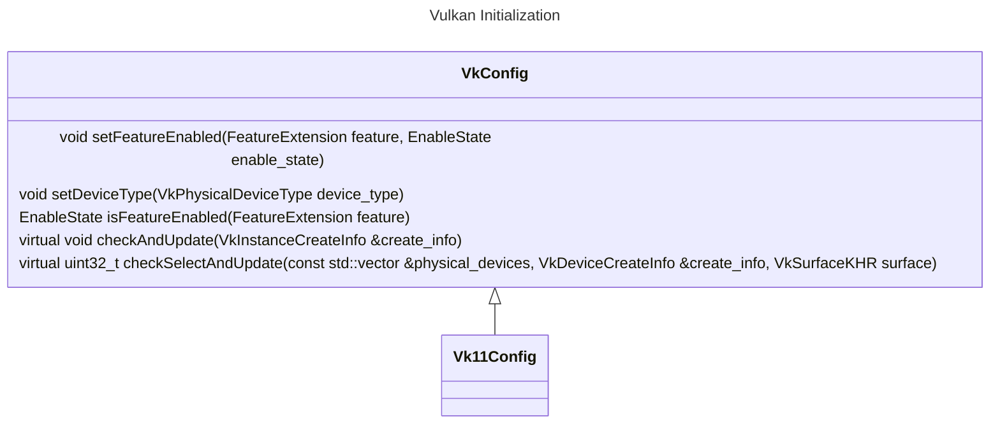
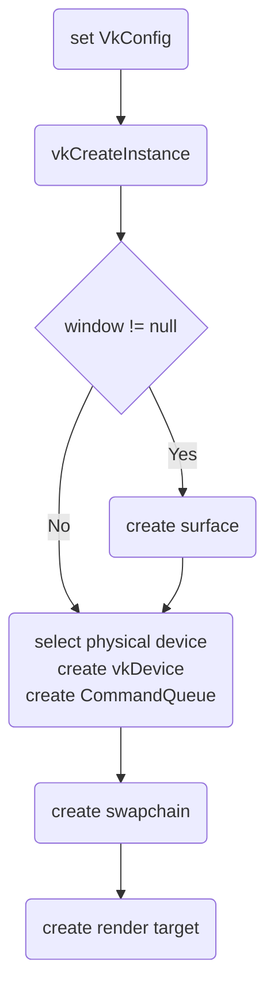
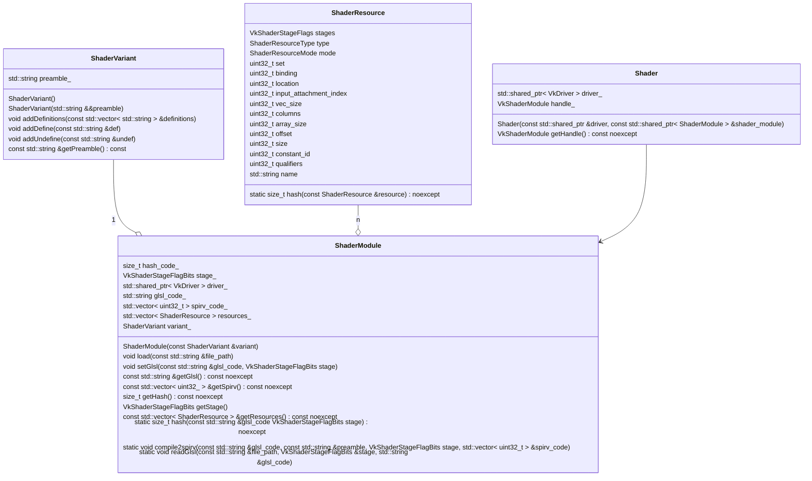
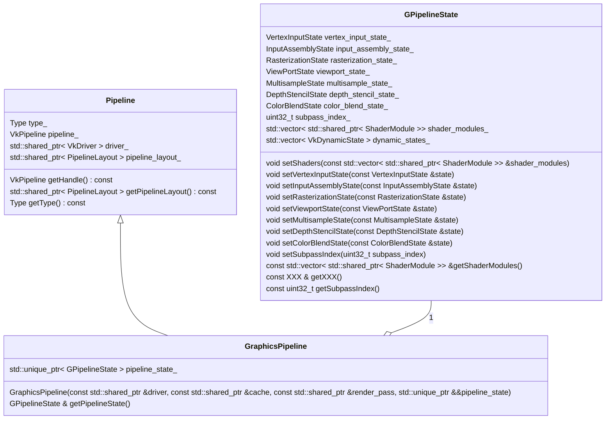
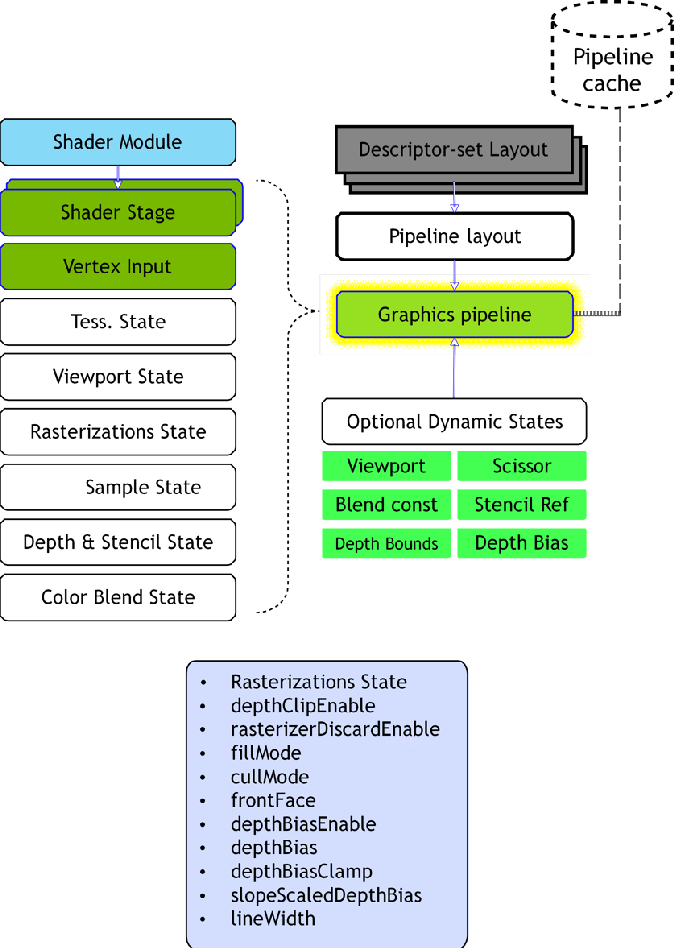
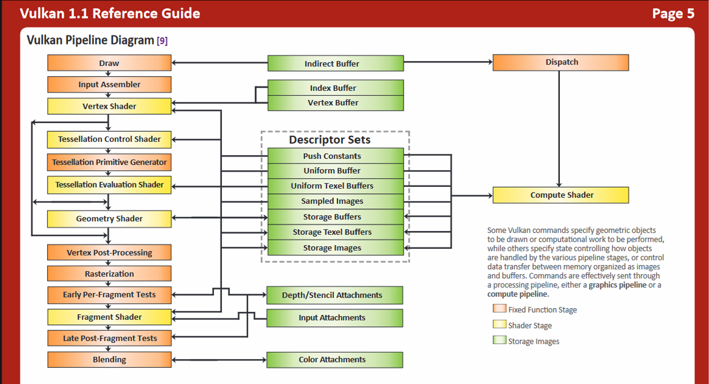
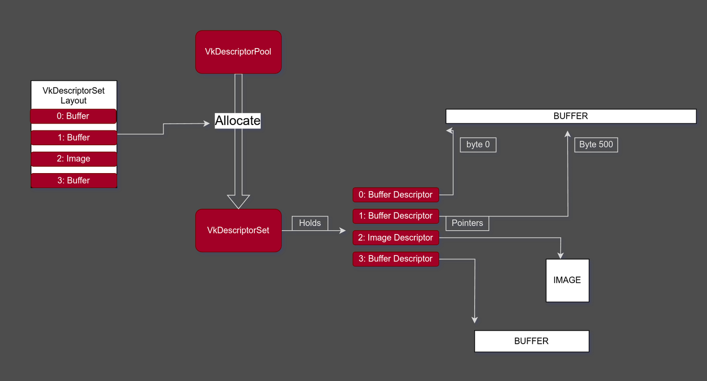
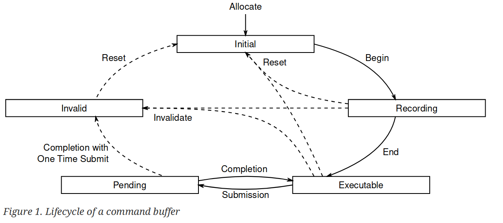
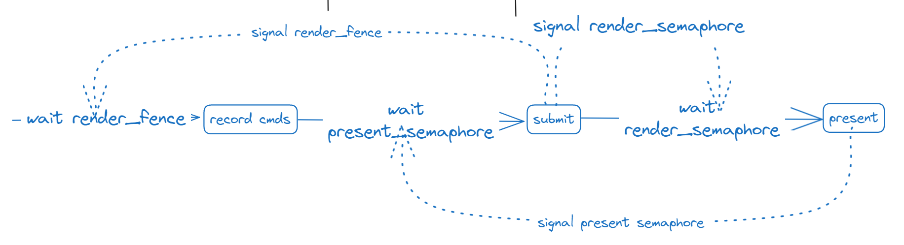
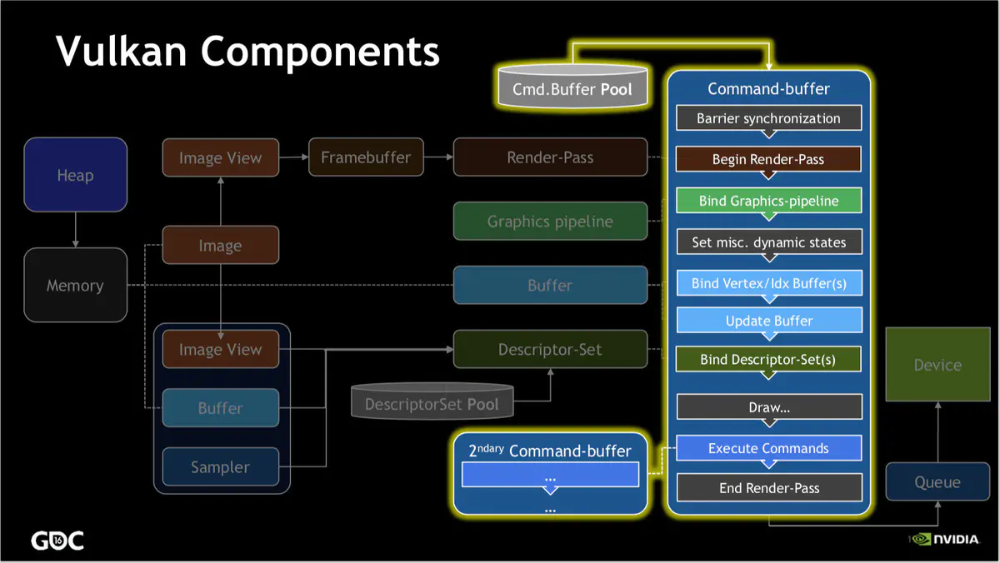

### Vulkan
#### Initialization
通过VkConfig类来设置Vulkan的配置, 高版本的Vulkan会将一些原来的扩展作为默认的特性, VkConfig被设计为一个虚类(接口).

| 函数 | 描述 |
| --- | --- |
| setFeatureEnabled | 设置启用的特性: instance extension, device extension |
| setDeviceType | 设置设备类型(独显/集显) |
| checkAndUpdate |  根据设置, 更新/设置VkInstanceCreateInfo |
| checkSelectAndUpdate | 根据设置+surface(可以是null), 选择合适的硬件设备, 并更新/设置VkDeviceCreateInfo |

初始化流程图(VkDriver::init):

#### ShaderModule

利用glslang将shader+shader_variant编译成spirv, 利用spirv-cross解析shader中用到的资源, 以被构建DescriptorSetLayout --> PipelineLayout.

#### Pipeline
| 类 | 描述 |
| --- | --- |
| Pipeline | Pipeline接口, 通过其获取vkPipeline 和 PipelineLayout. |
| GPipelineState | 封装了Graphics PipelineState的数据属性. |
| GraphicsPipeline | 接受GPipelineState, 创建vulkan graphics pipeline. |

#### RenderPass & Framebuffer

| 类 | 描述 |
| --- | --- |
| RenderPass (framework\vk\render_pass.h) | 封装了vkRenderPass, 表示了这个渲染Pass中的输出设置: attachment的load/store, subpass以及subpass之间的依赖关系, ttachment与subpass之间的联系. |
| RenderTarget (framework\vk\frame_buffer.h)| 封装了渲染的输出目标(color output imageview + depth output imageview) |
| FrameBuffer (framework\vk\frame_buffer.h)| 封装了VkFrameBuffer, 是RenderPass和RenderTarget的组合. |

在GraphicsPipeline创建时就需要设置VkRenderPass, 但后续在真正渲染时, 只要渲染输出的FrameBuffer与GraphicsPipeline中的VkRenderPass兼容即可.
兼容性要求:
* attachment 数量相同(允许有VK_ATTACHMENT_UNUSED)
* 对应attachment的format、sample count一致
* 允许attachment有不同的extend, load/store, layout

#### DescriptorSet & DescriptorPool
* 创建
    应该是为了更好地配合多线程, 提高性能, 在Vulkan中DescriptorPool像是一个内存池, 需要先申请一个大的pool(定义好能从中申请的DescriptorSet的规格和容量). 后续DescriptorSet从pool中进行申请.
    在很多引擎中是直接申请一个最大的DescriptorPool, 在这里, 我针对材质设置了一个定制的DescriptorPool.
    

* 更新和复用
    参考[writing-an-efficient-vulkan-renderer](https://zeux.io/2020/02/27/writing-an-efficient-vulkan-renderer/), 为了更好的性能, 避免不必要的DescriptorSet创建开销. 对OBJECT_SET_INDEX(MeshParamsPool), MATERIAL_SET_INDEX(MatGpuResourcePool), GLOBAL_SET_INDEX(AppContext.descriptor_pool)分别设置了不同规格的DescriptorSetPool, 并对使用完的DescriptorSet进行缓存复用. 

#### CommandPool & CommandBuffer
与DescriptorSet类似, CommandBuffer同Pool中去申请以提升性能. 在这里每一个FrameBuffer绑定一个CommandPool, 在每帧开始时将CommandPool进行Reset(所有从中创建的CommandBuffer返回到initial state), 然后取一个已经创建或新建(若不足)一个CommandBuffer进行命令录制.

#### Synchronize

Vulkan中的三种同步对象:

使用场景:
* 渲染和呈现循环
    
* RenderPass之间, 使用Barrier进行同步. 例如: 加载图片纹理后使用ImageBarrier将ImageLayout转换为OPTIMAL_LAYOUT. 在这里普通的场景渲染之后加了一个ImageBarrier, 然后再进行Imgui的渲染.

#### 功能类/函数

| 类 | 描述 |
| --- | --- |
| ResourceCache (framework/vk/resource_cache.h) | 参考Vulkan-Samples, 将一些可以服用的Vulkan 资源进行缓存复用, 例如: shader, DescriptorSetLayout, PipelineLayout, Sampler |
| StagePool (framework/vk/stage_pool.h) | 参考Filament, 一个GPU-CPU均能访问的buffer/image cache, 用来上传/下载数据. |

#### 渲染过程

