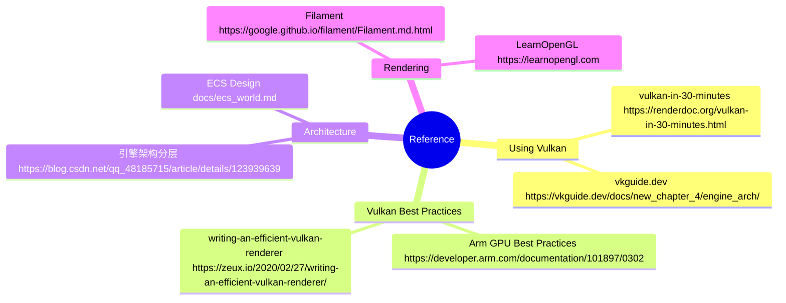

# Mango 引擎架构文档

> Mango 是一个基于 Vulkan 的轻量级渲染引擎，用于学习目的。

---

## 目录

1. [整体架构](#1-整体架构)
2. [构建产物](#2-构建产物)
3. [构建](#3-构建)
4. [模块详解](#4-模块详解)
   - [engine — 核心引擎库](#41-engine--核心引擎库)
   - [editor — 编辑器库](#42-editor--编辑器库)
   - [mango_editor — 可执行程序](#43-mango_editor--可执行程序)
5. [模块依赖关系](#5-模块依赖关系)
6. [主循环流程](#6-主循环流程)
7. [渲染管线](#7-渲染管线)
8. [资产系统](#8-资产系统)
9. [事件系统](#9-事件系统)
10. [第三方依赖](#10-第三方依赖)
11. [参考资料](#11-参考资料)

---

## 1. 整体架构

```
┌─────────────────────────────────────────────────────┐
│                  mango_editor (可执行)               │
│                   source/samples/editor             │
└─────────────────────┬───────────────────────────────┘
                      │ 依赖
┌─────────────────────▼───────────────────────────────┐
│                  editor (静态库)                     │
│               source/editor                         │
│  MenuUI / AssetUI / SimulationUI / WorldUI / ...    │
└─────────────────────┬───────────────────────────────┘
                      │ 依赖
┌─────────────────────▼───────────────────────────────┐
│                  engine (静态库)                     │
│               source/engine                         │
│  ┌──────────┐ ┌──────────┐ ┌────────────────────┐   │
│  │ platform │ │  asset   │ │     functional     │   │
│  └──────────┘ └──────────┘ │  ┌─────────────┐   │   │
│  ┌──────────────────────┐  │  │EngineContext│   │   │
│  │        utils         │  │  ├─────────────┤   │   │
│  │  ┌────┐ ┌───────┐    │  │  │    World    │   │   │
│  │  │ vk │ │ event │    │  │  ├─────────────┤   │   │
│  │  └────┘ └───────┘    │  │  │RenderSystem │   │   │
│  │  ┌────┐ ┌──────┐     │  │  └─────────────┘   │   │
│  │  │ log│ │ base │     │  └────────────────────┘   │
│  │  └────┘ └──────┘     │                           │
│  └──────────────────────┘                           │
└─────────────────────────────────────────────────────┘
```

---

## 2. 构建产物

| 产物 | 类型 | 源码路径 | 说明 |
|------|------|----------|------|
| `engine` | 静态库 | `source/engine` | 核心引擎，包含渲染、ECS、资产、平台等 |
| `editor` | 静态库 | `source/editor` | 编辑器 UI，依赖 engine |
| `mango_editor` | 可执行文件 | `source/samples/editor` | 最终应用程序入口 |

---

## 3. 构建

```bash
# 下载并编译第三方库（首次 checkout 必须执行）
python prepare.py

# 配置与构建
cmake -B build
cmake --build build --config Release --target mango_editor
```

> **注意：** 运行时工作目录必须为 `run\`，`FileSystem::init()` 会在相对路径下查找 `asset\` 目录，找不到则直接抛出异常。

---

## 4. 模块详解

### 4.1 engine — 核心引擎库

引擎库分为四个顶级目录：`platform`、`asset`、`functional`、`utils`。

#### 4.1.1 platform（平台层）

| 文件 | 说明 |
|------|------|
| `window.h` | 窗口抽象接口 |
| `glfw_window.h/cpp` | 基于 GLFW 的窗口实现，处理键盘/鼠标/滚轮/拖拽等输入，并将其转为引擎事件 |
| `file_system.h/cpp` | 文件系统，封装文件读写、路径操作 |

#### 4.1.2 asset（资产层）

负责引擎自有格式的序列化/反序列化，以及通过 assimp 导入外部 3D 格式（glTF、FBX 等）。

| 文件 | 说明 |
|------|------|
| `asset.h/cpp` | Asset 基类，定义资产类型枚举 `EAssetType` |
| `asset_manager.h/cpp` | 资产管理器，负责加载/保存/缓存各类资产 |
| `asset_mesh.h/cpp` | 静态网格资产（顶点、索引数据） |
| `asset_material.h/cpp` | 材质资产（PBR 参数、贴图引用） |
| `asset_texture.h/cpp` | 纹理资产，通过 stb_image 加载图片数据 |
| `asset_skeleton.h/cpp` | 骨骼资产 |
| `asset_skeletal_mesh.h/cpp` | 蒙皮网格资产 |
| `asset_animation.h` | 动画资产 |
| `assimp_importer.h/cpp` | 使用 assimp 导入外部 3D 场景 |
| `url.h/cpp` | 资产路径（URL）封装 |

#### 4.1.3 functional（功能层）

功能层是引擎的核心逻辑所在，包含以下子模块：

##### global（全局上下文）

| 类 | 说明 |
|----|------|
| `EngineContext` (`engine_context.h`) | **引擎全局单例 `g_engine`**，持有所有顶级子系统的 `shared_ptr`，控制初始化顺序与主循环各阶段（`gcTick` / `logicTick` / `renderTick`） |
| `ResourceBindingMgr` (`resource_binding_mgr.h`) | 管理 GPU 资源绑定，提供全局 DescriptorSet（含 Lighting UBO）和标准材质的 UBO 分配 |

##### world（世界/场景）

基于 **EnTT** ECS 框架的场景管理，详细设计见 [ecs_world.md](ecs_world.md)。

| 类 | 说明 |
|----|------|
| `World` (`world.h`) | 负责实体创建/销毁、场景导入（`importScene`）、场景保存（`saveAsWorld`）、Transform 树更新、相机更新 |

**ECS 实体组成：**

| 组件 | 类型 | 说明 |
|------|------|------|
| `std::string` | 值类型 | 实体名称 |
| `TransformComponent` | `shared_ptr<TransformRelationship>` | 变换（位移/旋转/缩放）及父子层级关系 |
| `StaticMeshComponent` | `shared_ptr<StaticMesh>` | 静态网格 |
| `MaterialComponent` | `shared_ptr<Material>` | 材质 |
| `CameraComponent` | 值类型 | 相机参数（FOV、near/far、EV100 等） |

##### render（渲染系统）

| 类 | 说明 |
|----|------|
| `RenderSystem` | 渲染系统，每帧从 World 收集 `RenderData`，驱动 `MainPass` 和 `UIPass` 执行 |
| `MainPass` | 主渲染通道，执行 3D 场景绘制（静态网格 + 材质 + 光照） |
| `UIPass` | UI 渲染通道，渲染 ImGui 界面，结果叠加到 swapchain 图像上 |
| `RenderData` | 帧渲染数据载体，包含 `StaticMeshRenderData` 列表（顶点/索引 buffer、材质 DescriptorSet、变换 PushConstant） |

##### component（组件定义）

| 文件 | 说明 |
|------|------|
| `component_transform.h` | `TransformRelationship`，记录位置/旋转/缩放及父子节点关系 |
| `component_camera.h` | `CameraComponent`，包含投影参数与 Trackball 控制器 |
| `components.h` | 类型别名声明（`StaticMeshComponent`、`MaterialComponent`、`TransformComponent`） |

#### 4.1.4 utils（工具层）

##### vk（Vulkan 封装）

对 Vulkan API 进行面向对象封装，是引擎渲染能力的基础设施。详细设计见 [vulkan.md](vulkan.md)。

| 类/文件 | 说明 |
|---------|------|
| `VkDriver` | **核心类**，封装 VkInstance / VkPhysicalDevice / VkDevice / VmaAllocator / Swapchain，管理帧同步信号量，提供线程本地 CommandBuffer 管理 |
| `VkConfig` | Vulkan 特性/扩展配置（版本、设备类型、扩展开关） |
| `ResourceCache` | **资源缓存**，以哈希为 key 缓存 ShaderModule、Shader、DescriptorSetLayout、PipelineLayout、RenderPass、Sampler、PipelineCache，避免重复创建 |
| `Buffer` | GPU Buffer 封装（顶点/索引/UBO 等），基于 VMA |
| `Image` / `ImageView` | GPU Image/ImageView 封装 |
| `ShaderModule` / `Shader` | GLSL → SPIRV 编译（glslang），SPIRV 反射（spirv-cross）解析资源绑定信息 |
| `Pipeline` / `PipelineLayout` | 图形管线封装 |
| `DescriptorSet` / `DescriptorSetLayout` | 描述符集封装 |
| `RenderPass` / `FrameBuffer` | 渲染通道与帧缓冲封装 |
| `CommandBuffer` / `CommandBufferMgr` | 命令缓冲封装与线程本地管理 |
| `Swapchain` | 交换链管理，处理 resize/recreate |
| `StagePool` | 上传缓冲区池，用于 CPU→GPU 数据传输 |
| `DataUploader` | 数据上传工具（纹理、缓冲区） |
| `Syncs` | Semaphore / Fence 封装 |
| `Barriers` | Image/Buffer 内存屏障辅助函数 |
| `SpirvReflection` | SPIRV 字节码反射，自动提取 binding/set/pushconstant 布局 |

##### event（事件系统）

基于 **eventpp** 库实现的异步事件总线。

| 事件类型 | 说明 |
|----------|------|
| `WindowKey/MouseButton/CursorPos/Scroll/Drop/Size/Close` 系列 | 窗口输入事件（由 GLFW 回调触发） |
| `RenderCreateSwapchainObjects` / `RenderDestroySwapchainObjects` | Swapchain 重建通知（触发 FrameBuffer 重建） |
| `RenderRecordFrame` | 帧录制触发事件 |
| `RenderConstructUI` | UI 构建触发事件 |
| `SelectEntity` / `PickEntity` | 实体选中/拾取事件 |
| `ImportScene` | 场景导入请求事件 |

##### log（日志系统）

基于 **spdlog** 的日志封装，`LogSystem` 提供分级日志输出。

##### base（基础工具）

| 文件 | 说明 |
|------|------|
| `timer.h/cpp` | 定时器与 `TimerManager` |
| `trackball.h/cpp` | Trackball 相机控制器（轨迹球旋转/平移/缩放） |
| `macro.h` | 常用宏定义（ASSERT、LOG 等） |
| `hash_combine.h` | 哈希组合工具（用于 ResourceCache key） |
| `memory.h` | 内存工具 |
| `strings.h/cpp` / `string_util.h/cpp` | 字符串工具 |
| `data_reshaper.hpp` | 数据布局重整工具 |
| `compiler.h` | 编译器相关宏 |
| `error.h` | 错误处理 |

---

### 4.2 editor — 编辑器库

编辑器层在引擎层之上构建 ImGui UI，提供场景编辑功能。

| 子模块 | 关键类 | 说明 |
|--------|--------|------|
| `global` | `EditorContext` (`g_editor`) | 编辑器全局状态（如是否全屏模拟视口） |
| `base` | `EditorUI` | 所有编辑器面板的抽象基类（`init` / `construct`） |
| `base` | `FolderTreeUI` | 文件夹树形视图基础组件 |
| `simulation` | `SimulationUI` | **3D 视口面板**，将 MainPass 的渲染结果作为 ImGui Image 显示，处理相机交互 |
| `menu` | `MenuUI` | 顶部菜单栏（文件打开/保存、场景导入等） |
| `asset` | `AssetUI` | 资产浏览器面板，显示文件系统中的资产 |
| `world` | `WorldUI` | 场景层级面板（实体树） |
| `property` | `PropertyUI` | 属性编辑面板（选中实体的组件属性） |
| `tool` | `ToolUI` | 工具栏 |
| `log` | `LogUI` | 日志输出面板 |

**Editor 主类：**

`Editor` 持有 `EditorUI` 列表，`init()` 中初始化 `g_engine`，`run()` 驱动主循环，`constructUI()` 在每帧 `RenderConstructUI` 事件中构建 ImGui 界面。

---

### 4.3 mango_editor — 可执行程序

```cpp
// source/samples/editor/main.cpp
mango::Editor *editor = new mango::Editor;
editor->init();
editor->run();
editor->destroy();
```

程序入口，仅负责创建 `Editor` 对象并驱动其生命周期。

---

## 5. 模块依赖关系

```
mango_editor
    └── editor
            ├── engine
            │     ├── platform  (FileSystem, GlfwWindow)
            │     ├── asset     (AssetManager, Assimp, stb_image)
            │     ├── functional
            │     │     ├── global   (EngineContext, ResourceBindingMgr)
            │     │     ├── world    (World + EnTT ECS)
            │     │     ├── render   (RenderSystem → MainPass, UIPass)
            │     │     └── component
            │     └── utils
            │           ├── vk      (VkDriver, ResourceCache, Buffer/Image, ...)
            │           ├── event   (EventSystem + eventpp)
            │           ├── log     (LogSystem + spdlog)
            │           └── base    (Timer, Trackball, ...)
            └── volk    (Vulkan 函数加载器)
```

**关键依赖方向（运行时）：**

```
Editor  ──→  EngineContext (g_engine)
                  ├──→  VkDriver
                  ├──→  Window
                  ├──→  EventSystem
                  ├──→  LogSystem
                  ├──→  FileSystem
                  ├──→  TimerManager
                  ├──→  ResourceCache
                  ├──→  AssetManager
                  ├──→  ResourceBindingMgr
                  ├──→  RenderSystem
                  │         ├──→ MainPass
                  │         └──→ UIPass
                  └──→  World
                            └──→ (EnTT registry of entities)
```

---

## 6. 主循环流程

`Editor::run()` 每帧执行如下步骤：

```
┌─────────────────────────────────────────────────┐
│ 主线程 (渲染线程)                                  │
│                                                   │
│  window->processEvents()                          │
│      └─ GLFW 轮询 → 触发 WindowXxxEvent           │
│                                                   │
│  g_engine.newTick()                               │
│      └─ 通知事件线程开始处理                        │
│                                                   │
│  g_engine.gcTick(dt)                              │
│      ├─ StagePool::gc()   (回收上传 staging buffer)│
│      └─ ResourceCache::gc() (回收不用的 GPU 资源)  │
│                                                   │
│  g_engine.logicTick(dt)                           │
│      └─ World::tick(dt)                           │
│           ├─ loadedMesh2World()  (异步加载提交)    │
│           ├─ updateTransform()                    │
│           └─ updateCamera()                       │
│                                                   │
│  g_engine.renderTick(dt)                          │
│      └─ RenderSystem::tick(dt)                    │
│           ├─ VkDriver::waitFrame()  (获取 swapchain│
│           │                          下一帧图像)  │
│           ├─ collectRenderDatas()                 │
│           ├─ MainPass::render()                   │
│           ├─ UIPass::render()  (含 ImGui 构建)    │
│           └─ VkDriver::presentFrame()             │
│                                                   │
│  g_engine.threadSync()                            │
│      └─ 等待事件线程完成                            │
└─────────────────────────────────────────────────┘

┌─────────────────────────────────────────────────┐
│ 事件线程 (Transfer/Event 线程)                    │
│                                                   │
│  等待主线程 newTick() 信号                         │
│  EventSystem::tick()  (处理事件队列)              │
│      └─ 事件回调（资产上传、场景导入等）             │
│  若有 Transfer 命令则提交到 Transfer Queue        │
│  通知主线程 threadSync() 完成                      │
└─────────────────────────────────────────────────┘
```

**双线程设计：** 主线程专注渲染，事件/Transfer 操作在独立线程中执行，通过 `std::binary_semaphore` 同步。

---

## 7. 渲染管线

```
World::tick()
    └─ 更新 Transform / Camera
           │
           ▼
RenderSystem::collectRenderDatas()
    └─ 遍历 World 中所有 StaticMesh 实体
    └─ 构建 RenderData（含 vertex/index buffer、material desc set、transform PCO）
           │
           ▼
MainPass::render()
    ├─ BeginRenderPass（3D FrameBuffer：color + depth attachment）
    ├─ 绑定 Pipeline（vertex/fragment shader）
    ├─ 绑定 Global DescriptorSet（Lighting UBO）
    ├─ 遍历 StaticMeshRenderData
    │    ├─ 绑定 Material DescriptorSet（albedo/metallic/roughness 贴图）
    │    ├─ PushConstant（Model 变换矩阵）
    │    └─ DrawIndexed
    └─ EndRenderPass
           │
           ▼
UIPass::render()
    ├─ 触发 RenderConstructUI 事件 → Editor::constructUI()
    │    └─ 各 EditorUI::construct() (ImGui 面板构建)
    │         包括 SimulationUI 将 3D 渲染结果嵌入 ImGui::Image
    ├─ ImGui::Render()
    └─ 将 ImGui draw data 提交到 swapchain 图像
           │
           ▼
VkDriver::presentFrame()
    └─ vkQueuePresentKHR → 显示到屏幕
```

**着色器：**

| 文件 | 说明 |
|------|------|
| `shaders/static_mesh.vert` | 顶点着色器：变换、法线变换 |
| `shaders/forward_lighting.frag` | 片段着色器：前向光照（PBR 基础） |
| `shaders/include/shader_structs.h` | CPU/GPU 共享的 UBO/PCO 结构体定义 |

---

## 8. 资产系统

```
外部文件 (.gltf/.fbx/.obj 等)
        │
        ▼
AssetManager::import3d(url)
        │
        ▼
AssimpImporter::import()
        ├─ 提取 Mesh → AssetMesh（序列化为 .mesh 文件）
        ├─ 提取 Material → AssetMaterial（序列化为 .mat 文件）
        └─ 提取 Texture → AssetTexture（序列化为 .tex 文件）
                                │
                                ▼
                   AssetManager::loadAsset<T>(url)
                   （反序列化 + 内存缓存）
                                │
                                ▼
                   World::importScene(url)
                   （创建 ECS 实体，绑定 Mesh/Material/Transform 组件）
                                │
                                ▼
                   DataUploader（通过 StagePool 上传到 GPU）
```

**序列化格式：** 使用 **cereal** 库，支持 JSON 和二进制两种格式（`EArchiveType`）。

---

## 9. 事件系统

基于 **eventpp** 的 `EventQueue`，支持同步和异步派发。

```cpp
// 订阅事件
g_engine.getEventSystem()->addListener(EEventType::ImportScene,
    [](const EventPointer& e) {
        auto evt = std::static_pointer_cast<ImportSceneEvent>(e);
        g_engine.getWorld()->importScene(evt->file_path);
    });

// 异步派发（入队，事件线程消费）
g_engine.getEventSystem()->asyncDispatch(
    std::make_shared<ImportSceneEvent>(file_path));

// 同步派发（立即执行所有回调）
g_engine.getEventSystem()->syncDispatch(event);
```

**事件处理线程：** `EngineContext` 在 `init()` 时创建专属事件处理线程，每帧由主线程通过信号量触发 `EventSystem::tick()`（消费队列中的异步事件）。

---

## 10. 第三方依赖

| 库 | 版本/位置 | 用途 |
|----|----------|------|
| **Vulkan** (via volk) | `thirdparty/volk` | Vulkan 函数动态加载，避免链接 vulkan-1.lib |
| **Vulkan-Hpp** | `thirdparty/Vulkan-Hpp` | Vulkan C++ 头文件 |
| **GLFW** | `thirdparty/install/lib/glfw3.lib` | 跨平台窗口与输入 |
| **VulkanMemoryAllocator** | install/cmake | GPU 内存分配（VMA） |
| **glslang** | install/cmake | GLSL → SPIRV 运行时编译 |
| **spirv-cross** | install/cmake | SPIRV 反射，提取资源绑定信息 |
| **assimp** | install/cmake | 3D 模型格式导入（glTF、FBX、OBJ 等） |
| **eventpp** | install/cmake | 事件队列/分发库 |
| **spdlog** | install/cmake | 高性能日志库 |
| **GLM** | `thirdparty/glm` | 数学库（向量、矩阵） |
| **Eigen** | `thirdparty/eigen` | 线性代数库 |
| **Dear ImGui** | `thirdparty/imgui` | 即时模式 GUI（含 GLFW + Vulkan 后端） |
| **ImGuiFileDialog** | `thirdparty/ImGuiFileDialog` | ImGui 文件对话框 |
| **cereal** | `thirdparty/cereal` | C++ 序列化（JSON/二进制） |
| **stb_image** | `thirdparty/stbi` | 图片加载（PNG/JPG 等） |
| **EnTT** | (engine 内部头文件引用) | ECS 框架（Entity Component System） |
| **refl-cpp** | `thirdparty/refl-cpp` | C++ 编译期反射 |

---

## 11. 相关文档

| 文档 | 说明 |
|------|------|
| [render_system.md](render_system.md) | 材质系统、光照模型、物理相机与着色器绑定 |
| [vulkan.md](vulkan.md) | Vulkan 子系统详解：初始化、着色器、管线、同步 |
| [ecs_world.md](ecs_world.md) | ECS 世界系统详解：设计原因、组件、场景导入 |

---

## 12. 参考资料


