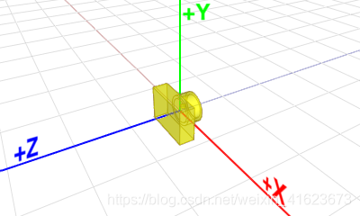

# Render System

## Material System

材质由 `Material` 类持有，对应着色器的 `set=1` 描述符集（1 个 UBO + 4 张贴图）。

### 材质参数（CPU → GPU UBO）

```cpp
struct UMaterial {
  uint albedo_type;                        // ParamType: 0=常量颜色, 1=纹理
  uint emissive_type;                      // ParamType: 0=常量颜色, 1=纹理
  uint metallic_roughness_occlution_type;  // ParamType: 0=常量值,  1=纹理
  uint padding0;
  vec4 albedo_color;                       // 当 albedo_type==0 时使用
  vec4 emissive_color;                     // 当 emissive_type==0 时使用
  vec4 metallic_roughness_occlution;       // .x=metallic .y=roughness .z=occlusion
};
```

### 材质贴图绑定（set=1）

| binding | 类型 | 说明 |
|---|---|---|
| 0 | `uniform _UMaterial` | 材质 UBO（见上表） |
| 1 | `sampler2D albedo_map` | Albedo / Base Color |
| 2 | `sampler2D normal_map` | 切线空间法线贴图 |
| 3 | `sampler2D emissive_map` | 自发光贴图 |
| 4 | `sampler2D metallic_roughness_occlusion_map` | 金属度(R)·粗糙度(G)·AO(B) 打包贴图 |

`albedo_type` / `emissive_type` / `metallic_roughness_occlution_type` 区分使用常量值还是贴图采样，着色器据此选择路径（PBR 计算函数待完善）。

### 材质生命周期

```
AssetMaterial（磁盘序列化）
    └── AssetManager::loadAsset<AssetMaterial>()
            └── Material::inflate()
                    ├── 创建 material_buffer_（VkBuffer UBO）
                    ├── 上传 UMaterial 数据
                    ├── 通过 ResourceBindingMgr 分配 DescriptorSet（set=1）
                    └── 绑定 4 张贴图（VkImageView + Sampler）
```

---

## Lighting

### 光度学术语

| 光度学量 | 符号 | 单位 |
| --- | :---: | --- |
| 光通量（Luminous power） | $\Phi$ | 流明（$\text{lm}$） |
| 发光强度（Luminous intensity） | $I$ | 坎德拉（$\text{cd}$）或 $\frac{\text{lm}}{\text{sr}}$ |
| 照度（Illuminance） | $E$ | 勒克斯（$\text{lx}$）或 $\frac{\text{lm}}{\text{m}^2}$ |
| 亮度（Luminance） | $L$ | 尼特（$\text{nt}$）或 $\frac{\text{cd}}{\text{m}^2}$ |

### 光源 UBO（set=0 binding=0）

```cpp
struct ULighting {
  UDirectionalLight directional_lights[8];  // 方向光，最多 8 盏
  UPointLight       point_lights[8];        // 点光源，最多 8 盏
  uint              light_num[2];           // [0]=方向光数量 [1]=点光源数量
  float             ev100;                  // 相机曝光值
};
```

### 方向光（Directional Light）

```cpp
struct UDirectionalLight {
  vec4 direction;   // 世界空间光线方向（xyz），w 填充
  vec4 illuminance; // 照度值（lx），xyz 三通道，w 填充
};
```

方向光使用**照度**（Illuminance, $E$，单位 lx）作为强度参数。对于无穷远的平行光，到达表面的照度不随距离衰减。

### 点光源（Point Light）

```cpp
struct UPointLight {
  vec4 position;          // 世界空间位置（xyz），w 填充
  vec4 luminous_intensity; // 发光强度（cd），xyz 三通道，w 填充
};
```

点光源使用**发光强度**（Luminous intensity, $I$，单位 cd = lm/sr）作为强度参数。表面接收的照度按距离平方衰减：

$$
E = \frac{I}{d^2} \cos\theta
$$

其中 $d$ 是光源到表面的距离，$\theta$ 是入射角。

---

## Imaging Pipeline

### Physically-Based Camera（物理相机）

| 参数 | 定义 | 符号 |
| --- | --- | --- |
| Focal length | 焦距（毫米） | $f$ |
| Aperture | 光圈大小，以 f-stop 表示 $F = f/d$（$d$ 为光圈直径） | $N$，典型值：f/1, f/1.4, f/2, f/2.8, f/4, f/5.6 … |
| Shutter speed | 快门速度（秒） | $t$ |
| ISO | 感光度 | $S$ |

参考 [Exposure_value](https://en.wikipedia.org/wiki/Exposure_value)，曝光值定义如下（值越小灵敏度越高）：

$$
\begin{aligned}
EV_s &= \log_2\frac{N^2}{t}\\[4pt]
EV_{100} &= \log_2\!\left(\frac{N^2}{t} \cdot \frac{100}{S}\right)
         = EV_s - \log_2\frac{S}{100}
\end{aligned}
$$

参考 [Film speed](https://en.wikipedia.org/wiki/Film_speed)，胶片/传感器上的曝光量 $H$（单位 $\text{lx·s}$，$q=0.65$）：

$$
H = \frac{q \cdot t}{N^2} \cdot L = q \cdot 2^{-EV_{100}} \cdot L
$$

在一定光照下，标准曝光（自动曝光）由下式决定：

$$
\frac{N^2}{t} = \frac{L \cdot S}{K} = \frac{E \cdot S}{C}
$$

其中 $L$ 为被测场景亮度（反射），$K = 12.5\ \text{cd·s/(m·ISO)}^2$ 为测光表标定值；$E$ 为照度，$C = 250\ \text{lm·s/(m}^2\text{·ISO)}$ 为入射光测光表标定值。

**引擎实现**：`CameraComponent` 只暴露 `ev100` 一个参数（Aperture / Shutter speed / ISO 统一折算为 EV100 后传入 UBO）。

参考实现：
- Filament: `View.cpp → mPerViewUniforms.prepareDirectionalLight`
- [UE5 Auto Exposure](https://docs.unrealengine.com/5.3/en-US/auto-exposure-in-unreal-engine/)

### Coordinate System（坐标系）

全部使用**右手坐标系**。

相机坐标系：



---

## Shader Pipeline

### Descriptor Set Layout

```
set=0  (Global, 每帧一次绑定)
  binding=0  ULighting UBO  — 光源数据 + ev100

set=1  (Material, 每个 DrawCall 绑定)
  binding=0  UMaterial UBO  — 材质参数
  binding=1  sampler2D      — albedo_map
  binding=2  sampler2D      — normal_map
  binding=3  sampler2D      — emissive_map
  binding=4  sampler2D      — metallic_roughness_occlusion_map

Push Constant  (per-object, 每个 DrawCall 推送)
  TransformPCO { mat4 m, mat4 nm, mat4 mvp }
```

### 顶点着色器（static_mesh.vert）

输入：`vec3 vpos`（模型空间顶点位置）、`vec3 normal`（模型空间法线）、`vec2 uv`

输出：`vec2 out_uv`、`vec3 out_normal`（世界空间法线）、`vec3 out_pos`（世界空间位置）

法线变换使用法线矩阵 `nm = transpose(inverse(m))`，以处理非均匀缩放的情况。

### 片段着色器（forward_lighting.frag）

当前状态：直接输出 albedo 贴图颜色（PBR 光照计算占位符，待实现 BRDF）。

待实现路径：

```glsl
MaterialInfo mat_info = calc_material_info();  // 从贴图/常量混合计算材质信息
o_color = calc_pbr(mat_info);                  // 调用 PBR BRDF 函数
```
