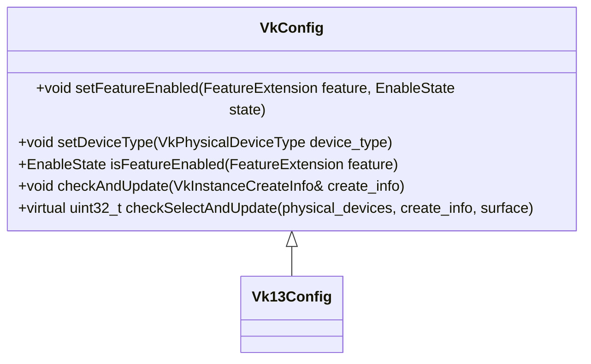
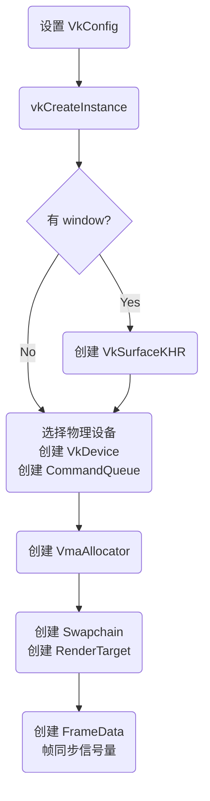
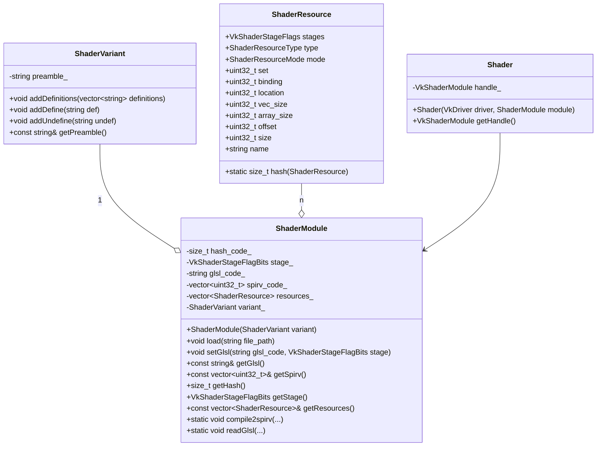
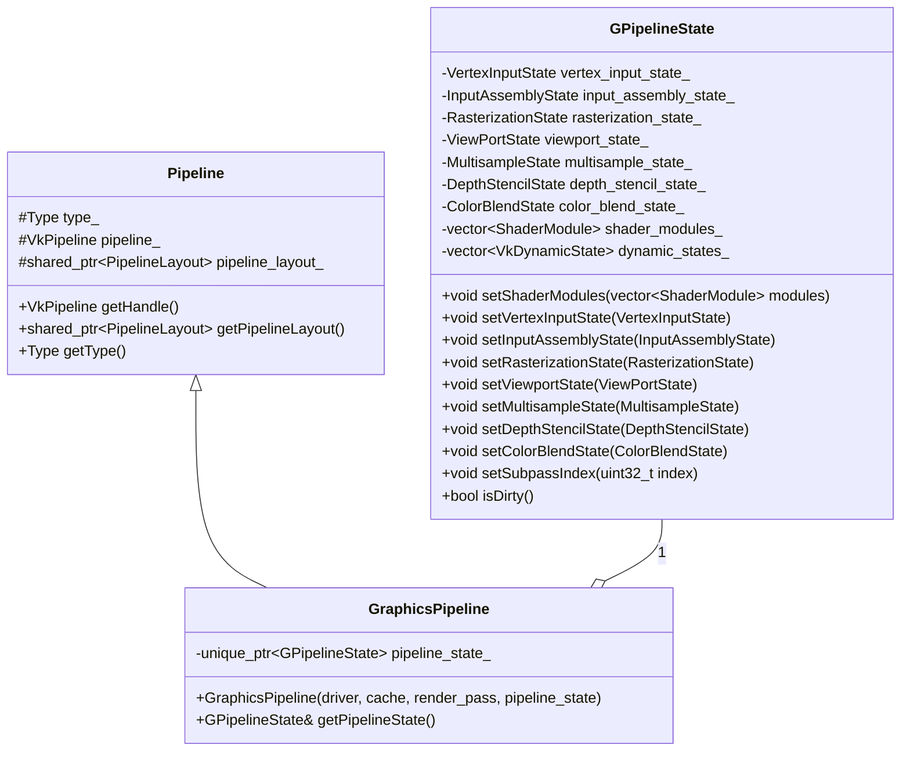

# Vulkan 子系统

`source/engine/utils/vk/` 对 Vulkan API 进行面向对象封装，是引擎渲染能力的基础设施。

---

## 目录

1. [初始化（VkDriver / VkConfig）](#1-初始化vkdriver--vkconfig)
2. [ShaderModule 与反射](#2-shadermodule-与反射)
3. [Pipeline（管线）](#3-pipeline管线)
4. [RenderPass 与 FrameBuffer](#4-renderpass-与-framebuffer)
5. [DescriptorSet 与 DescriptorPool](#5-descriptorset-与-descriptorpool)
6. [CommandPool 与 CommandBuffer](#6-commandpool-与-commandbuffer)
7. [同步原语（Syncs / Barriers）](#7-同步原语syncs--barriers)
8. [功能辅助类](#8-功能辅助类)
9. [渲染帧流程总览](#9-渲染帧流程总览)

---

## 1. 初始化（VkDriver / VkConfig）

通过 `VkConfig` 的子类来设置 Vulkan 的特性和扩展开关，然后传入 `VkDriver::init()` 完成初始化。

### VkConfig 类层级



`Vk13Config`（使用 Vulkan 1.3）在 Debug 构建时自动启用 Validation Layer 和 `EXT_DEBUG_UTILS`，并强制启用 VMA 所需的扩展（`KHR_GET_MEMORY_REQUIREMENTS_2`、`KHR_DEDICATED_ALLOCATION`、`KHR_BUFFER_DEVICE_ADDRESS` 等）以及 `DESCRIPTOR_INDEX` 扩展。

### VkDriver::init 初始化流程



`VkDriver` 持有：
- `VkInstance` / `VkPhysicalDevice` / `VkDevice`
- `VmaAllocator`（GPU 内存分配）
- 两个 `CommandQueue`：`graphics_cmd_queue_`、`transfer_cmd_queue_`
- `Swapchain`、`DescriptorPool`、`StagePool`
- 每帧两个 `Semaphore`（image_available、render_result_available）
- 每线程一个 `ThreadLocalCommandBufferManager`

---

## 2. ShaderModule 与反射

利用 **glslang** 将 GLSL 源码编译成 SPIRV，再用 **spirv-cross** 解析 shader 中用到的资源，以自动构建 `DescriptorSetLayout` → `PipelineLayout`。



`ShaderResourceType` 枚举覆盖：`Input`、`InputAttachment`、`Output`、`Image`、`ImageSampler`、`ImageStorage`、`Sampler`、`BufferUniform`、`BufferStorage`、`PushConstant`、`SpecializationConstant`。

`ShaderResourceMode` 分为 `Static`、`Dynamic`、`UpdateAfterBind`，影响 DescriptorSet 的创建与绑定方式。

---

## 3. Pipeline（管线）



默认动态状态（Dynamic State）为 `VK_DYNAMIC_STATE_VIEWPORT` 和 `VK_DYNAMIC_STATE_SCISSOR`。

`ResourceCache` 负责按哈希缓存 `PipelineLayout`、`DescriptorSetLayout`、`RenderPass`、`Sampler` 等对象，避免重复创建。

---

## 4. RenderPass 与 FrameBuffer

| 类 | 文件 | 说明 |
|----|------|------|
| `RenderPass` | `render_pass.h` | 封装 `VkRenderPass`，定义 attachment 的 load/store op、subpass 以及 subpass 依赖关系 |
| `RenderTarget` | `framebuffer.h` | 渲染输出目标（color ImageView + depth ImageView） |
| `FrameBuffer` | `framebuffer.h` | 封装 `VkFramebuffer`，是 RenderPass 与 RenderTarget 的组合 |

`GraphicsPipeline` 在创建时需要绑定一个 `VkRenderPass`；运行时真正渲染时，只要实际 `FrameBuffer` 与创建时的 `RenderPass` **兼容**即可：

- attachment 数量相同（允许有 `VK_ATTACHMENT_UNUSED`）
- 对应 attachment 的 format、sample count 一致
- 允许 extend、load/store op、layout 不同

---

## 5. DescriptorSet 与 DescriptorPool

### 数据绑定规约

| Descriptor Set | 用途 |
|---|---|
| `set=0`（Global） | 全局属性，对场景所有物体生效，例如：Lighting UBO（方向光 + 点光 + ev100） |
| `set=1`（Material） | 材质参数，例如：材质 UBO + 4 张贴图 |

Push Constant（per-object）：`TransformPCO { mat4 m, mat4 nm, mat4 mvp }`

### 创建与复用

`DescriptorPool` 是一个内存池，需要预先分配好能从中申请的 DescriptorSet 规格和容量，DescriptorSet 从 pool 中申请。

引擎对材质的 DescriptorPool 做了定制（`ResourceBindingMgr` 管理全局 set=0，材质 `inflate()` 管理 set=1）。

参考 [writing-an-efficient-vulkan-renderer](https://zeux.io/2020/02/27/writing-an-efficient-vulkan-renderer/)，引擎对已用完的 DescriptorSet 进行缓存复用，避免不必要的创建开销。

---

## 6. CommandPool 与 CommandBuffer

与 DescriptorSet 类似，CommandBuffer 从 CommandPool 中申请以提升性能。

`ThreadLocalCommandBufferManager` 为每个线程维护独立的 CommandPool：
- 主线程：负责 Graphics CommandBuffer
- 事件/Transfer 线程：负责 Transfer CommandBuffer

每帧开始时，CommandPool 执行 Reset（所有从中创建的 CommandBuffer 回到 initial state），然后取一个已有的或新建一个 CommandBuffer 进行命令录制。

---

## 7. 同步原语（Syncs / Barriers）

### 三种同步对象

| 对象 | 类 | 适用场景 |
|------|-----|---------|
| `Semaphore` | `syncs.h` | GPU-GPU 同步，用于队列间、交换链 present |
| `Fence` | `syncs.h` | GPU-CPU 同步，用于等待帧完成 |
| Memory Barrier | `barriers.h` | GPU 内部 pipeline stage 与内存访问同步 |

### 渲染与 Present 循环同步

每帧使用两个 Semaphore：
- `image_available`：交换链获取下一帧图像后发出信号，Graphics Queue 等待此信号开始渲染
- `render_result_available`：Graphics Queue 渲染完成后发出信号，Present Queue 等待此信号后 present

### RenderPass 间 Barrier

主场景渲染（MainPass）结束后，在进入 UIPass（ImGui）前通过 `ImageBarrier` 转换 Image Layout，确保上一 pass 的写入对下一 pass 可见。

加载纹理后同样使用 `ImageBarrier` 将 `ImageLayout` 转换为 `SHADER_READ_ONLY_OPTIMAL`。

---

## 8. 功能辅助类

| 类 | 文件 | 说明 |
|----|------|------|
| `ResourceCache` | `resource_cache.h` | 参考 Vulkan-Samples，缓存复用 Shader、DescriptorSetLayout、PipelineLayout、RenderPass、Sampler 等可复用 Vulkan 资源 |
| `StagePool` | `stage_pool.h` | 参考 Filament，CPU/GPU 均可访问的 buffer/image 暂存池，用于数据上传 |
| `DataUploader` | `data_uploader.hpp` | 封装纹理和缓冲区的上传流程（通过 StagePool 和 Transfer Queue） |
| `SpirvReflection` | `spirv_reflection.h` | 基于 spirv-cross 解析 SPIRV 字节码，自动提取 set/binding/push_constant 布局 |

---

## 9. 渲染帧流程总览

```
VkDriver::waitFrame()
    ├─ vkAcquireNextImageKHR  →  获取 swapchain image index
    └─ 更新 cur_frame_index_ / cur_image_index_

命令录制（主线程）：
    MainPass::render()
        ├─ BeginRenderPass
        ├─ vkCmdBindPipeline
        ├─ vkCmdBindDescriptorSets (set=0 Lighting, set=1 Material)
        ├─ vkCmdPushConstants (TransformPCO)
        ├─ vkCmdDrawIndexed
        └─ EndRenderPass

    ImageBarrier (MainPass → UIPass layout 转换)

    UIPass::render()
        ├─ ImGui::NewFrame / 构建 UI
        ├─ ImGui::Render
        └─ ImGui draw data 提交到 swapchain image

VkDriver::presentFrame()
    ├─ vkQueueSubmit  (等待 image_available，发出 render_result_available)
    └─ vkQueuePresentKHR (等待 render_result_available)
```

---

## 参考

- [Vulkan in 30 Minutes](https://renderdoc.org/vulkan-in-30-minutes.html)
- [Writing an Efficient Vulkan Renderer](https://zeux.io/2020/02/27/writing-an-efficient-vulkan-renderer/)
- [Arm GPU Best Practices](https://developer.arm.com/documentation/101897/0302)
- [Vulkan limits reference](https://vulkan.gpuinfo.org/displaydevicelimit.php?platform=windows&name=minUniformBufferOffsetAlignment)
